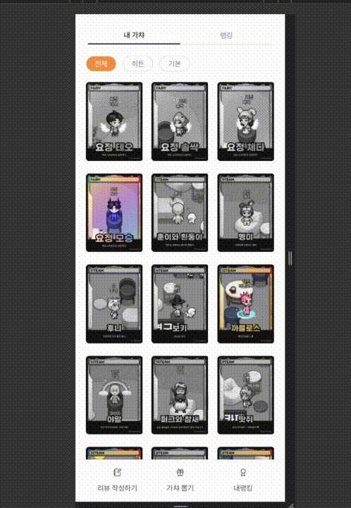
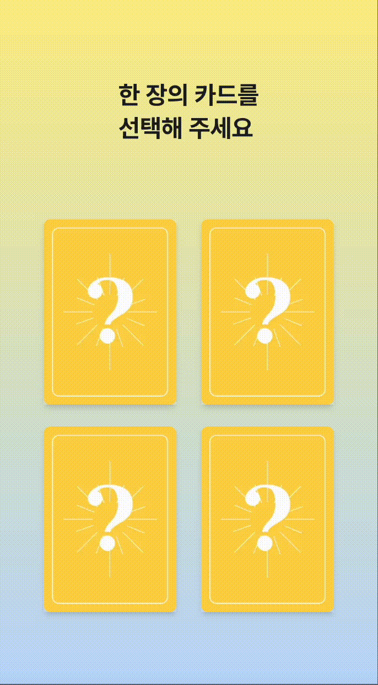

# 🌟 가챠리뷰! (ReviewGacha)
## 팀명: 별이 다섯개

### 🚀 프로젝트 개요
- **프로젝트 기간**: 2024.12.03 ~ 2024.12.09

### 📝 프로젝트 설명
가챠리뷰는 사용자들이 서로의 리뷰를 보고 상호작용하며, 재미있는 보상 시스템을 통해 콘텐츠 공유와 참여를 촉진하는 혁신적인 플랫폼입니다.

### ✨ 주요 기능
- 다른 사용자의 리뷰 조회
- 리뷰에 대한 좋아요 기능
- 리뷰 작성 후 가챠권 보상
- 가챠권으로 가챠 뽑기
- 마이페이지에서 개인 가챠 목록 및 전체 랭킹 조회

### 🛠️ 기술 스택 및 라이브러리

- [`create-next-app`](https://nextjs.org/docs/app/api-reference/cli/create-next-app)
  - Nextjs v15 app router
  - Typescript
  - Tailwindcss
  - ESLint
  - Shadcn
- nodejs v22
  - [nvm](https://github.com/nvm-sh/nvm) 을 사용해 버전 맞춤 권장

### 🎥 프로젝트 데모

#### 데모 영상

<!--   -->
   

